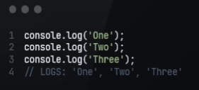
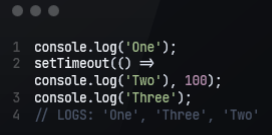
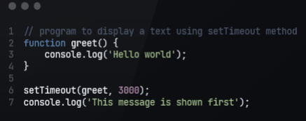
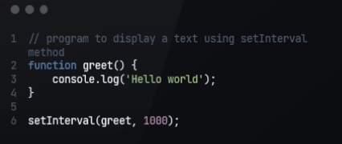
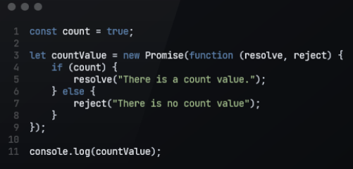
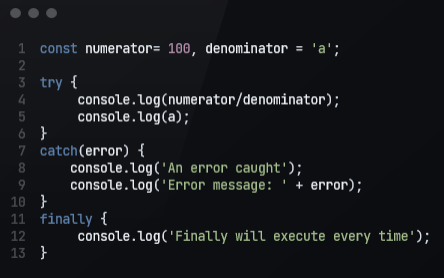

# APP

## Synchronous

Synchronous code runs in sequence. This means that each operation must wait for the previous one to complete before executing.

## Asynchronous

Asynchronous code runs in parallel. This means that an operation can occur while another one is still being 
processed.

## setTimeout() - Example

## setInterval() - Example

## Promise

## Try/catch/finally

